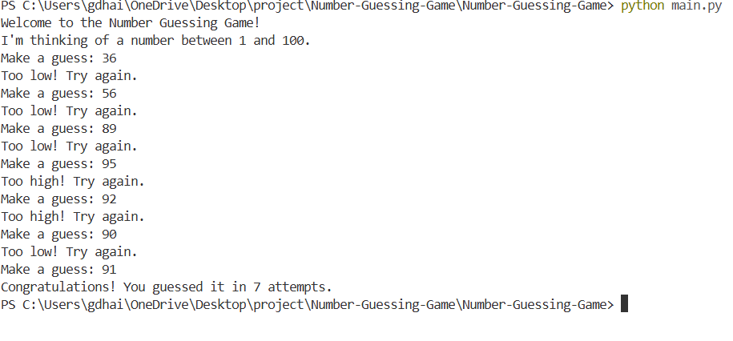

# 🎮 Number Guessing Game

A simple, interactive command-line game built with Python. The computer selects a random number between 1 and 100, and the player has to guess it with hints for "Too High" or "Too Low".

## ✨ Features
- **Random Number Generation:** Every game is unique.
- **Input Validation:** Prevents the game from crashing if you type text instead of numbers.
- **Attempt Counter:** Tracks how many tries it took you to win.
- **Infinite Loop:** The game runs until you guess correctly.
- 
## 📸 Screenshot


## 🛠️ Technologies Used
- **Language:** Python 3
- **Libraries:** `random` (Standard Library)

## 🚀 How to Run the Project
You can play this game on your local machine by following these steps:

1. **Clone the repository:**
   ```bash
   git clone (https://github.com/dhairyakumar018/Number-Guessing-Game.git)
2. **Open VS Code Terminal and paste repository**
3. **After that write in terminal:**
   ```bash
   cd Number-Guessing-Game
4. **Then one more time:**
  ```bash
python main.py
