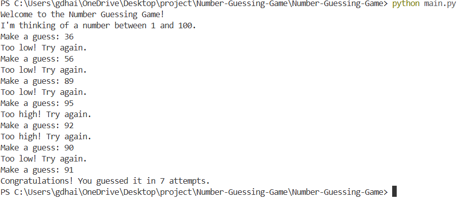

# 🎮 Number Guessing Game

A simple, interactive command-line game built with Python. The computer picks a
random number between 1 and 100, and you have to find it — with "Too high" and
"Too low" hints guiding you in.

## ✨ Features
- **Random number generation** — every game is unique
- **Input validation** — typing text instead of a number won't crash the game
- **Attempt counter** — tracks how many tries it took you to win
- **Plays until you win** — the loop only ends on the correct guess

## 📸 Screenshot


## 🚀 How to run

You'll need Python 3 installed. Then:

```bash
git clone https://github.com/dhairyakumar018/Number-Guessing-Game.git
cd Number-Guessing-Game
python main.py
```

On some systems the command is `python3 main.py`.

## 🎯 How to play

The game picks a secret number between 1 and 100. Type a guess and press Enter:

```
Welcome to the Number Guessing Game!
I'm thinking of a number between 1 and 100.
Make a guess: 50
Too low! Try again.
Make a guess: 75
Too high! Try again.
Make a guess: 62
Congratulations! You guessed it in 3 attempts.
```

Guessing the middle of the remaining range each time (binary search) will always
find the number in 7 guesses or fewer.

## 🛠️ Technologies used
- **Language:** Python 3
- **Libraries:** `random` (standard library)

## 🤖 Another project

Looking for something more tactical? **[MechStrike](https://github.com/dhairyakumar018/MechStrike)**
is a simultaneous-turn mech battle on an 8×8 grid, playable in the browser or the
terminal.
