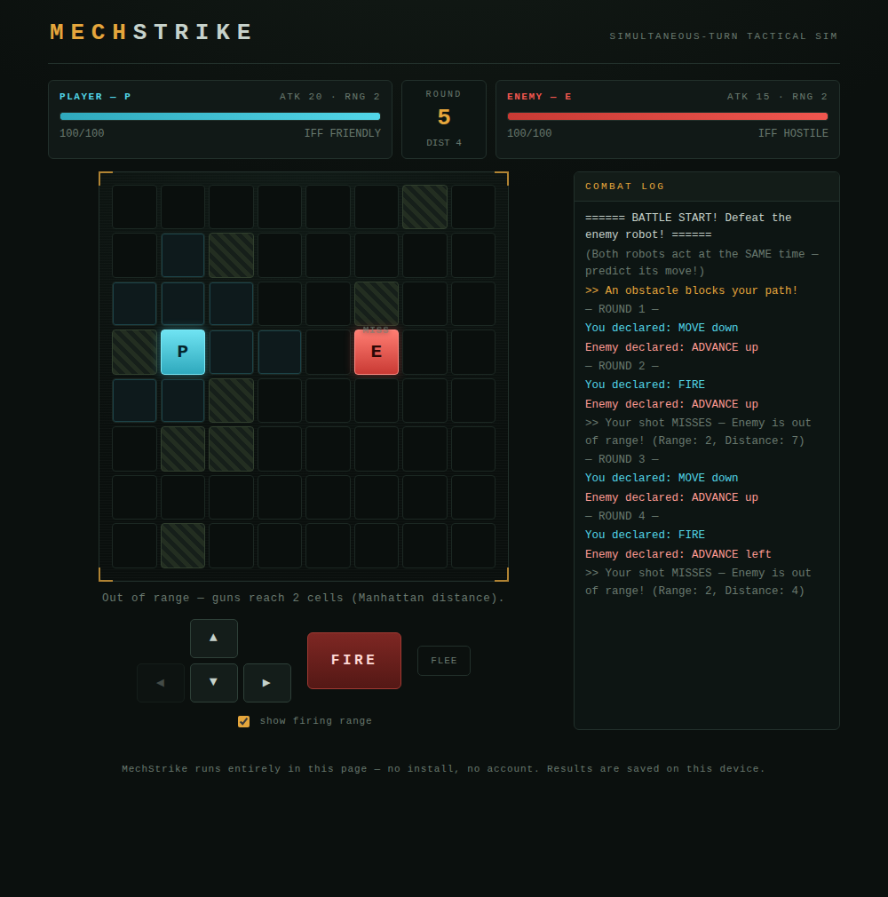
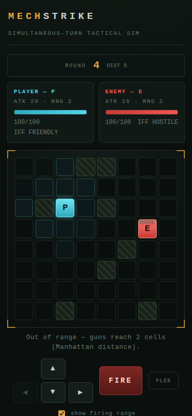

# 🎮 Number Guessing Game & MechStrike

Two small, self-contained games in one repository:

| Game | What it is | How to play |
|---|---|---|
| 🔢 **Number Guessing Game** | The classic "too high / too low" guessing game, in the terminal | `python main.py` |
| 🤖 **MechStrike** | A simultaneous-turn tactical mech battle on an 8×8 grid | **[▶ Play in your browser](https://dhairyakumar018.github.io/Number-Guessing-Game/)** — or compile the C++ console edition |

---

## 🤖 MechStrike — Tactical Battle Simulator

> **[▶ Play now — no install, works on phone and desktop](https://dhairyakumar018.github.io/Number-Guessing-Game/)**

Each round, you and the enemy AI declare actions **at the same instant**, then both
resolve together. Dodge the shot the enemy is about to take, cut off its retreat,
or fire at the cell it is *about* to occupy.

<p align="center">
  
  
</p>

### ⚔️ How it plays
- **8×8 battlefield** with random obstacles. You (`P`, 100 HP, 20 ATK) vs the enemy (`E`, 100 HP, 15 ATK), both with attack range 2 (Manhattan distance).
- **Declare blind, resolve together:** movement happens first, shots resolve *after* movement — so a well-predicted shot lands on the cell the enemy walks into.
- **Clash:** moving to the same cell (or swapping cells) bounces both mechs back.
- **Mutual destruction is possible** — both mechs can die in the same round for a draw.
- **Enemy AI:** fires if you start the round in its range, retreats below 30% health, otherwise hunts you down.
- **Statistics** (wins / losses / draws, win rate, average rounds) are saved between sessions.

### 🕹️ Controls
| Action | Keys |
|---|---|
| Move | `W` `A` `S` `D` or arrow keys (on-screen D-pad on touch) |
| Fire | `F` or `Space` |
| Flee (counts as a loss) | `Q` — asks for confirmation |
| Menu shortcuts | `1` new game · `2` statistics · `3` instructions |

### 🚀 Run it yourself
**Web edition** — one file, zero dependencies:
```bash
# just open it in any modern browser
mechstrike/index.html
```

**Console edition** — pure standard-library C++:
```bash
cd mechstrike
g++ main.cpp -o mechstrike
./mechstrike        # Windows: mechstrike.exe
```

Full rules, AI details, and file formats: [`mechstrike/README.md`](mechstrike/README.md)

---

## 🔢 Number Guessing Game

A simple, interactive command-line game built with Python. The computer picks a
random number between 1 and 100, and you have to find it with "Too high" /
"Too low" hints.

### ✨ Features
- **Random number generation** — every game is unique
- **Input validation** — typing text instead of a number won't crash the game
- **Attempt counter** — tracks how many tries it took you to win
- **Plays until you win** — the loop only ends on the correct guess

### 📸 Screenshot


### 🚀 How to run
```bash
git clone https://github.com/dhairyakumar018/Number-Guessing-Game.git
cd Number-Guessing-Game
python main.py
```

---

## 📁 Repository structure
```
├── main.py                  # Number Guessing Game (Python)
├── gameplay.png             # Number Guessing Game screenshot
└── mechstrike/
    ├── index.html           # MechStrike web edition (self-contained, deployed to GitHub Pages)
    ├── main.cpp             # MechStrike console edition (standard-library C++)
    ├── README.md            # Full MechStrike documentation
    └── screenshots/         # Desktop and mobile captures
```

## 🛠️ Technologies
- **Python 3** — Number Guessing Game (`random`, standard library)
- **C++** — MechStrike console edition (iostream/fstream/ctime, standard library only)
- **HTML + CSS + JavaScript** — MechStrike web edition, no frameworks or build step
- **GitHub Pages** — live deployment of the web edition
